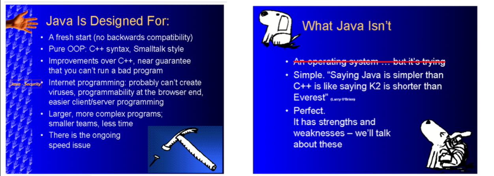

# Introduction

Java is a derived language. The core changes to C++ were the incorporation of JVM \(Java virtual machine\) and garbage collector.  

Requiring that everything be an object \(especially all the way down to the lowest level\) is a design mistake, but banning objects altogether seems equally hard. 

Programming is about managing complexity: the complexity of the problem, laid upon the complexity of the machine.

