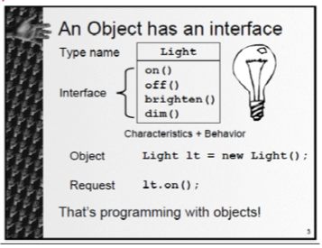

# Everything is an object!

What is an object?

**An object has state, behaviour and identity.**

This means an object can have internal data \(which gives it state\), methods \(to produce behaviour\) and each object is uniquely distinguished from every other object - that is every object has a unique address in memory.

An object has an interface:

Objects that are identical except for their state are grouped together into "classes of objects", and thats where the keyword class arose. 

Creating abstract data types \(classes\) is a fundamental concept in object-oriented programming.

 

